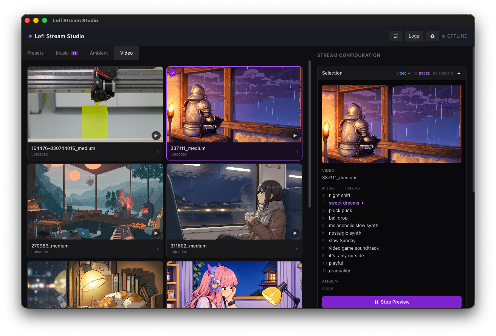
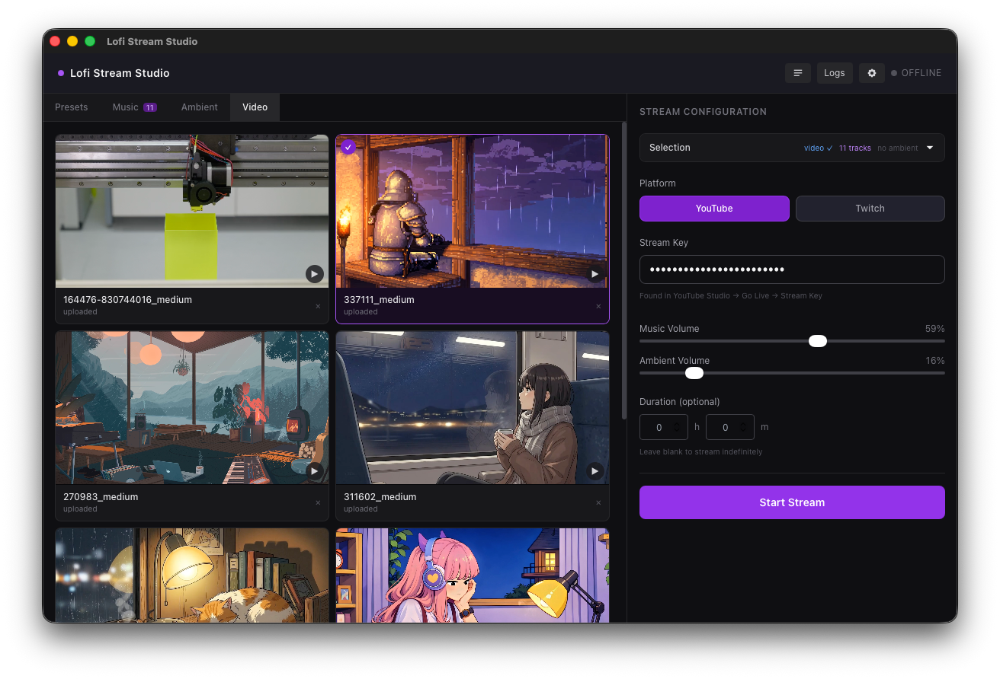

# Steadycast

A desktop app for broadcasting lofi (or any other always-on ambient stream) to YouTube and Twitch without any streaming software setup.

Sample stream produced with Steadycast featuring synthetic audio [here](https://www.youtube.com/watch?v=MqRrxQ121Ak)




Built with Tauri, React, and a bundled FFmpeg binary.

## How it works

At its core, Steadycast is a wrapper around a single FFmpeg command that combines a video source, a music playlist, and an optional ambient layer into an [RTMP](https://en.wikipedia.org/wiki/Real-Time_Messaging_Protocol) stream:

```sh
ffmpeg \
  -re -stream_loop -1 -i background.mp4 \
  -i track1.mp3 -i track2.mp3 -i track3.mp3 \
  -stream_loop -1 -i ambient.mp3 \
  -filter_complex "
    [1:a][2:a]acrossfade=d=3:c1=tri:c2=tri[xcf1];
    [xcf1][3:a]acrossfade=d=3:c1=tri:c2=tri[xcf_last];
    [xcf_last]volume=0.8[amusic];
    [4:a]volume=0.4[aambient];
    [amusic][aambient]amix=inputs=2:duration=first[aout]
  " \
  -map 0:v -map "[aout]" \
  -c:v libx264 -preset veryfast -b:v 4500k \
  -c:a aac -b:a 192k -ar 44100 \
  -f flv rtmp://a.rtmp.youtube.com/live2/<stream-key>
```

Steadycast builds and manages this command through a GUI, handling playlist cycling, crossfades, preview playback, and stream key storage so you never have to write it by hand.

## Features

- Stream to YouTube or Twitch via RTMP
- Music playlist with smooth crossfade transitions between tracks (no hard cuts)
- Ambient sound layer with independent volume control
- Video loop or still image as the visual source
- Built-in synthesizer for generating lofi music and ambient tracks via [Tone.js](https://tonejs.github.io), inspired by [meel-hd/lofi-engine](https://github.com/meel-hd/lofi-engine)
- In-app preview that mirrors the actual stream output including crossfades
- Save and load stream presets

## Requirements

- macOS (primary target; Windows and Linux are untested)
- No FFmpeg installation needed; it is bundled as a sidecar binary

## Development

```sh
pnpm install
pnpm tauri dev
```

```sh
pnpm tauri build
```
